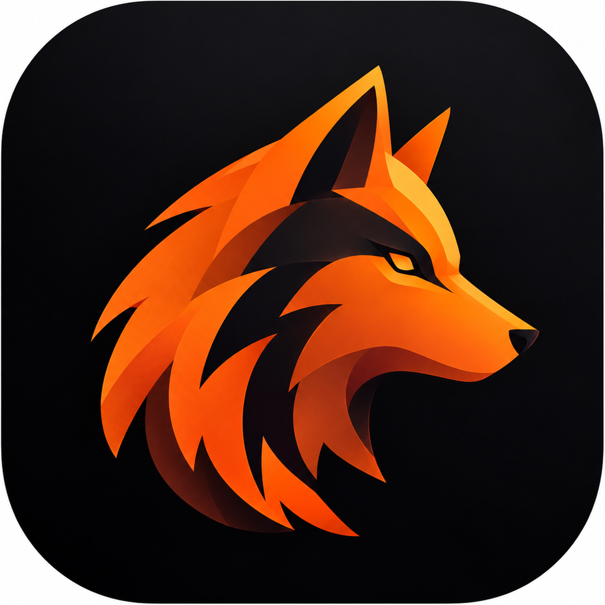

# WOLFPACK



일정을 **시간축 위에 정렬된 상태로** 편집·공유하는 데스크톱 보드.
마스코트는 펜리르(Fenrir). 북유럽 신화에 등장하는 늑대. 집중력과 끈기의 상징. 목표를 향해 꾸준히 나아가는 모습. 

구글 캘린더 일간 화면에서 영감을 받았음 — 세로는 시간, 가로는 병렬 트랙.
PPT 도형으로 관리하던 일정을 옮겨, 주간 갱신과 선후행 추적이 가능하게 하는 것이 목적이다.

> 공수·원가·리소스 배정·결재는 이거랑 관계 없음. 칸반식 WBS는 대체할 수도 있음(프로젝트 성격에 따라). 이 도구는 **보고·합의용 시각화 보드**이며 PMS로 업그레이드는 나중 일.

## 실행

```bash
npm install
npm start
```

Electron 앱이 뜨면 **프로젝트 목록**이 먼저 나온다. 보드 하나가 프로젝트 하나이고,
과제·연차마다 따로 만들어 쓴다. 데이터는 SQLite 파일 하나에 자동 저장된다.

| 명령 | 설명 |
|---|---|
| `npm start` | 앱 실행 |
| `npm run dev` | 개발자 도구를 함께 연다 |
| `npm test` | 스모크 — 창을 띄워 렌더와 저장 왕복을 확인하고 종료 |
| `npm test -- --shot ./shots` | 위에 더해 화면을 PNG로 남긴다 |
| `npm start -- --db ./machina.db` | DB 파일을 직접 지정 (과제별로 나눠 쓸 때) |
| `npm run dist` | Windows 설치 파일 생성 |

DB 기본 위치는 `%APPDATA%/wolfpack/wolfpack.db` — 메뉴의 **파일 › DB 파일 위치 열기**로 바로 갈 수 있다.

## 쓰는 법

### 프로젝트

첫 화면에서 열 프로젝트를 고른다. **새 프로젝트**는 빈 보드로 시작하고,
**예시 로드맵으로 시작**은 Project Machina 1차년도 일정이 들어간 보드를 만든다.
각 항목에서 복제·이름 변경·삭제를 할 수 있다. 보드를 보는 중에는 툴바 왼쪽
**프로젝트**로 목록에 돌아간다.

프로젝트끼리는 완전히 격리된다 — 트랙도 담당 조직도 일정도 서로 공유하지 않는다.

### 보드

| 하고 싶은 것 | 조작 |
|---|---|
| 일정 옮기기 | 카드를 끈다. 위아래는 날짜, 좌우는 트랙 |
| 기간 늘리기 | 카드 **위** 가장자리를 끌면 시작일, **아래** 가장자리를 끌면 종료일이 움직인다 |
| 일정 안에 일정 넣기 | 편집 패널의 **상위 일정**에서 품을 일정을 고른다 |
| 안에 든 일정의 가로 폭 | 그 카드의 **좌·우** 가장자리를 끈다. 더블클릭하면 자동 배치로 돌아간다 |
| 글자 세로 정렬 · 비고 표시 | 편집 패널 |
| 일정 만들기 | 빈 칸을 더블클릭하거나 툴바 **+ 일정** |
| 일정 고치기 | 카드를 클릭하면 우측 패널이 열린다 |
| 트랙 추가·순서·삭제 | 툴바 **구성**, 또는 헤더 오른쪽 **+** |
| 담당 조직 추가·이름변경·삭제 | 툴바 **구성 › 담당 조직** |
| 화살표 굵기·걸침 깊이·글자 크기 | 툴바 **구성 › 표시** |
| 글자 크기 | 툴바 **가− / 가＋**, 또는 `Ctrl` `+` / `-` / `0`(원래대로) |
| 상태·조직으로 거르기 | 상단 요약 바의 칩을 누른다 |
| 찾기 | 상단 검색창 (`Ctrl+F`). 맞는 일정만 또렷하게 남는다 |
| 카드 글자 복사 | 툴바 **I** 버튼 (`Ctrl+I`) — 선택 모드. 켜는 동안 드래그 이동은 멈춘다 |
| 되돌리기 / 다시 실행 | `Ctrl+Z` / `Ctrl+Shift+Z` |
| 반출·반입 | **데이터** 패널 — JSON 파일로 저장하거나 불러온다 |
| 이전 시점으로 | **데이터 › 변경 이력**에서 복원 |
| 내보내기 | 툴바 **내보내기** — PNG · PDF · 인쇄 |
| 왼쪽 달력 칸 묶기 | 월 칸을 세로로 끈다 → 이름 입력 (예: 1~3월 → `2027 1Q`) |
| 묶은 칸 이름 바꾸기 · 해제 | 더블클릭 · 우클릭 |
| 묶은 칸 접기 | 칸 아래 가장자리를 세로로 끈다. 그 구간의 일정도 같이 눌린다 |
| 트랙 열 너비 | 트랙 헤더 오른쪽 가장자리를 끈다. 더블클릭하면 자동으로 되돌아간다 |
| 일정이 여러 트랙에 걸치게 | 카드 **오른쪽** 가장자리를 끈다 (트랙 칸 단위로 붙는다). 편집 패널의 **트랙 걸침 (칸)** 으로도 된다 |
| 편집 패널 폭 | 패널 왼쪽 가장자리를 끈다 |
| 편집 패널 고정 | 패널 우측 상단 압정 버튼 — 켜면 Esc로도 닫히지 않는다 |

## 데이터

문서 하나가 보드 하나다.

```jsonc
{
  "version": 5,
  "meta": {
    "start": "2026-09-21", "end": "2027-04-04", "name": "Project Machina 1차년도",
    "display": { "arrowWidth": 7, "arrowHead": 2, "fontScale": 1 }
  },
  "orgs": ["다임리서치", "다임랩스", "에이텍모빌리티", "에이텍오토", "LG에너지솔루션", "공동"],
  "bands": [ { "id": "b1", "from": "2027-01-01", "to": "2027-03-31", "label": "2027 1Q" } ],
  "tracks": [ { "id": "t0", "lab": "요구사항 4", "name": "통합 모니터링 시스템" } ],
  "items": [{
    "id": "e10",
    "t":  "t0",           // 트랙 id
    "sp": 1,              // 트랙 병합 폭
    "s":  "2026-10-01",   // 시작
    "e":  "2026-10-31",   // 종료 (inclusive)
    "ti": "1년차 과제 제출용 화면 구성",
    "ty": "bar",          // bar | ms(마일스톤)
    "parent": null,       // 상위 일정 id — 있으면 그 카드 안에 들어간다
    "x": null, "w": null, // 트랙/상위 카드 안에서의 가로 위치·폭 비율 (null = 자동)
    "align": "middle",    // 글자 세로 정렬 top | middle | bottom
    "showNote": false,    // 비고를 카드에 표시
    "st": "run",          // plan | run | done | late | hold
    "og": "다임리서치",
    "pg": 20,             // 진척률
    "dp": ["e2"],         // 선행 일정 (표시 전용)
    "note": ""
  }]
}
```

PNG와 PDF는 화면에 보이는 부분이 아니라 **트랙 헤더부터 마지막 일정까지 전체**를
한 장에 담는다. PNG는 2배 해상도, PDF는 보드 크기에 맞춘 단일 페이지다.

SQLite 안에서는 `board` · `track` · `org` · `item` · `dependency` · `revision` 테이블로
정규화돼 있어 조직별·기간별 집계나 선후행 추적을 SQL로 바로 할 수 있다.
`board` 한 행이 프로젝트 하나이고, 나머지 테이블은 전부 `board_id`로 갈라진다.

**트랙 축에는 정해진 의미가 없다.** 요구사항으로 쓰든 작업패키지로 쓰든 조직이나
설비로 쓰든 사용자가 정한다. `lab`은 위에 작게 붙는 자유 라벨일 뿐이다.

선후행 화살표는 같은 트랙이면 카드 아래에서 위로, **다른 트랙이면 측면끼리** 잇는다.
카드 사이 틈이 좁으면 화살표가 점처럼 보이므로 **양쪽 카드에 걸쳐** 길게 뽑는다.
굵기·머리 크기·걸침 깊이는 구성 패널에서 조절하고 문서에 함께 저장된다.

**담당 조직 목록은 보드 안에서 편집한다** (구성 › 담당 조직). 프로젝트마다 다르다.
조직명은 일정에 문자열로 들어가므로, 이름을 바꾸면 그 조직이 담당한 일정도 함께 갱신된다.

상태 5종(계획·진행중·완료·지연·보류)은 `src/config/index.js`에서 바꾼다.

## 진행 상황

- [x] **P0** 시간축 보드, 드래그 편집, 상태·조직 필터, 선후행 표시, 인쇄, 다크 테마
- [x] **P0+** Electron 데스크톱 앱, SQLite 파일 DB, 변경 이력, JSON 파일 반출입, 다시 실행
- [x] **멀티 프로젝트** 프로젝트 목록 첫 화면, 신규·복제·이름변경·삭제
- [x] **담당 조직 편집** 보드 안에서 추가·이름변경·순서·삭제
- [x] **내보내기** 보드 전체를 PNG 한 장 / PDF 한 장으로
- [x] **시간축 구간** 여러 달을 묶어 분기 등으로 표시
- [x] **중첩 일정** 큰 덩어리 안에 세부 일정, 가로 폭 수동 조절, 글자 정렬, 비고 표시
- [ ] **P1** 읽기 전용 공유, 인쇄 레이아웃 정리
- [ ] **P2** 선행 일정 지연 시 영향 경고, 다중 사용자
- [ ] **P3** 산출물 체계 연계

## 디자인

다임리서치 UI/UX 가이드라인 v1.0을 기준으로, WOLFPACK Light / Dark UI Design Guide
(`refs/`)를 세부 규격으로 따른다. 요점은 셋이다.

- 정보 계층은 색이 아니라 **Surface 깊이 · 여백 · 약한 Border**로 만든다.
  Light는 `neutral-50` 캔버스 위 흰 카드, Dark는 `neutral-950 → 900 → 800`.
- **Orange는 장식이 아니라 신호다.** 오늘 · 선택 · 진행 표시자 · 주요 CTA · 포커스에만 쓴다.
  카드 배경을 상태 색으로 칠하지 않는다.
- 브랜드 마크(FENRIR)는 앱 아이콘 · 런처 · 툴바 브랜드 영역에만 둔다. UI 곳곳에 반복하지 않는다.

## 만드는 사람에게

구조와 규약은 [CLAUDE.md](./CLAUDE.md)에 있다.
